<h1 align="center">SECOND CHANCE WEB</h1>

[View the live webpage here](https://second-chance-web.herokuapp.com/)
--


Our generation is facing a major global concern: adapting our current lifestyle to achieve a better environment sustainability.

The scope of the website is to give good products a “second chance” (as the title suggests) so that they can fulfill their technical lifetime
before being discarded.

The website I created is a second-hand products web-shop where users can sell different things they don’t need but still in proper functionality. 

The purpose of the **buyer visitors** is to find good products at affordable prices which otherwise would be too expensive or necessary just temporary.
Like people relocating for a short-term and they need some furniture or people who wouldn’t spend a lot of money on new bikes for the children
and they rather buy second hand until kids grow old enough to use the same size for longer time.

The purpose of the **seller visitors** is to be able to get some money out of the products which don’t serve their needs anymore.

My personal purpose as a developer in creating Second Chance Web website is learning how to design, develop and implement the back-end for a web
application using Python, Flask micro-framework and MongoDB database.

The creation of this website is subject solely to educational purposes.

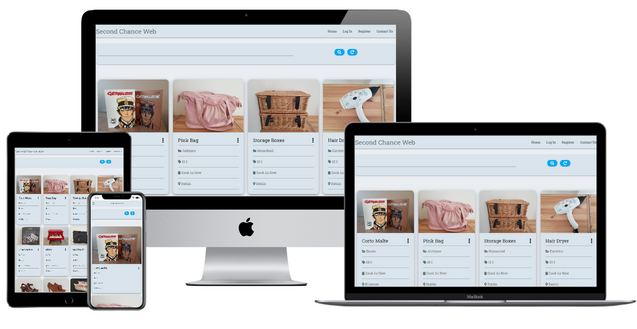

# Table of contents
1. [User Experience](#user-experience)
    1. [User Sories](#user-stories)
        1. [Buyer Users](#buyer-users)
        1. [Seller Users](#seller-users)
    1. [Design](#design)
        1. [Overall Design](#overall-design)
        1. [Color Palette](#color-pallette)
        1. [Typography](#typography)
        1. [Imagery](#imagery)
    1. [Wireframes](#wireframes)
    1. [Second Chance Web Collections in MongoDB](#second-chance-collections-in-mongodb)
1. [Features](#features)
    1. [Features Left to Implement](#features-left-to-implement)
1. [Technologies Used](#technologies-used)
    1. [Languages Used](#anguages-used)
    1. [Frameworks, Libraries & Programs Used](#frameworks-libraries-and-programs-used)
1. [Testing](#testing)
    1. [Functionality](#unctionality)
        1. [Navigation bar](#navigation-bar)
        1. [Ads](#ads)
        1. [Search bar](#search-bar)
        1. [Redirect pages](#redirect-pages)
        1. [Flash messages](#flash-messages)
        1. [Contact Form](#contact-form)
        1. [Cancel Buttons](#cancel-buttons)
        1. [Footer section](#footer-section)
    1. [Testing User Stories from User Experience (UX) Section](#testing-user-stories-from-user-experience-(UX)-Section)
        1. [Testing Buyer User Stories](#testing-buyer-user-stories)
        1. [Testing Seller User Stories](#testing-seller-user-stories)
    1. [Validation](#validation)
    1. [Further Testing](#further-testing)
    1. [Fixed Bugs](#fixed-bugs)
    1. [Known Bugs](#known-bugs)
1. [Deployment](#deployment)
1. [Forking the GitHub Repository](#forking-the-gitHub-repository)
1. [Making a Local Clone](#making-a-local-clone)
1. [Credits](#credits)
    1. [Images](#images)
    1. [Code](#code)
    1. [Tutor Support](#tutor-support)
    1. [Mentor](#mentor)
    1. [Slack Comunity](#slack-comunity)
    1. [My Family](#my-family)

# User Experience
## User Stories
### **Buyer Users**
1. As a buyer user I want to be able to easily find the products I'm looking for buying.
1. As a buyer user I want to be able to find clear information about the products like title, description, images, quality, price, location.
1. As a buyer user I want to be able to find contact information about the person who sells the product I'm looking for.
1. As a buyer user I want to be able to contact somebody if I'm not satisfied with my purchase.
### **Seller Users**
1. As a seller user I want to be able to register.
1. As a seller user I want to be able to login into "My Account".
1. As a seller user I want to be able to view and delete my account.
1. As a seller user I want to be able to post different products for advertising with the selling scope.
1. As a seller user I want to be the only user able to update and delete my posts.
## Design
### **Overall design**
For the overall design I chose neutral colors and simple formats, no background images and no unnecessary styling because I want the posted ads to be the center of users' attention.
### **Color Palette**

### **Typography**
Main font-family used throughout the website is [Roboto Slab](https://fonts.google.com/specimen/Roboto+Slab?query=rob&sidebar.open=true&selection.family=Roboto+Slab) with Sans serif as fall back.
### **Imagery**
All images used for the ads posted in the website were taken by the developer and are subject for demonstration only.
## Wireframes
-   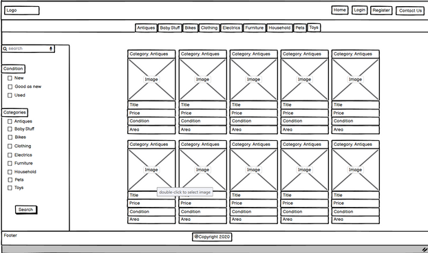
-   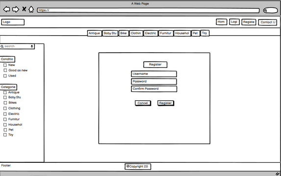
-   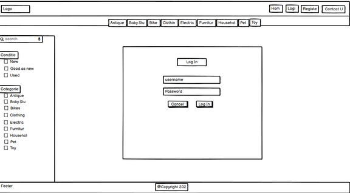
-   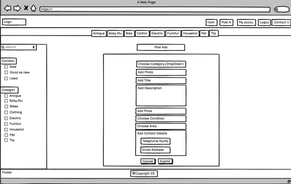
-   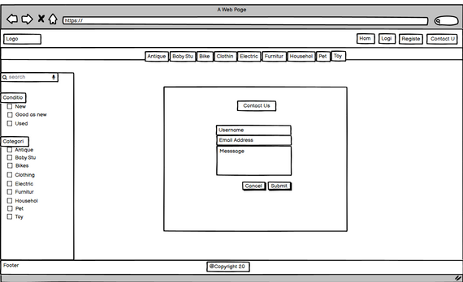
-   
## Second Chance Web Collections in MongoDB
-   The database for Second Chance Web contains 6 collections:
    -   Ads
    -   Categories
        -   Antiques.
        -   Art.
        -   Baby Stuff.
        -   Bags.
        -   Bikes.
        -   Books.
        -   Clothing.
        -   Electrics.
        -   Furniture.
        -   Household.
        -   Pets.
        -   Shoes.
        -   Toys.
    -   Conditions.
        -   New.
        -   Good as New.
        -   Used.
    -   Ireland_areas.
        -   Ireland Counties.
    -   N_ireland_areas.
        -    North Ireland counties.
    -   Users.
# Features
1. Responsiveness on different device sizes.
1. Mobile collapse button.
1. Search bar where the user can find products filtered by title, category name and description.
1. Reset button which brings the user back to the home page.
1. Interactive cards displaying succint information of the advertised products both on card content and card reveal.
    Card reveal gets triggered when clicked on the photo or on the title of the card content.
1. Registration form fields: Username, Password and Password confirmation.
1. Delete account option with dialog modal pops up to ask the user to confirm the deletion.
1. Log in form fields: Username and Password.
1. Log out.
1. Post advertising form fields: Category, Url for photos, Title, Description, Price,
    Condition, Area, Telephone, Email. Option buttons for edit and cancel which brings the user to the homepage.
1. Options for Edit and Delete the post available only for the user who posted. The delete button triggers a dialog modal asking for deletion confirmation.
1. Confirmation messages following commands as registration, logging in, logging out, post ad, edit and delete post, etc.
1. Contact form with 3 fields for filing in: username, email and message.
1. 404 page implemented.
1. Favicon.
1. Defensive programming. The Delete Account button in the profile page triggers a dialog modal which gives the user the
    possibility to choose from deleting the account or not. Same works for Delete button for the ads users can post.
## Features left to implement
1. Side Filter with index options for area, condition, category.
1. Add to User's Profile the contact details and password.
1. The User's option to edit the profile.
1. The User's option to post an advertising with the registered profile details.
1. The contact form to being automatically filled in with the username and emailaddress of the user currently logged in.
# Technologies Used
## Languages Used
-   [HTML5](https://en.wikipedia.org/wiki/HTML5)
-   [CSS3](https://en.wikipedia.org/wiki/Cascading_Style_Sheets)
-   [JavaScript](https://nl.wikipedia.org/wiki/JavaScript)
-   [Python3](https://en.wikipedia.org/wiki/Python_(programming_language))
## Frameworks, Libraries & Programs Used
1. [MongoDB:](https://www.mongodb.com/)
    -   MongoDB was used for creating the database collections.
1. [Flask:](https://flask.palletsprojects.com/en/1.1.x/)
    - Flask was used as the web application framework.
1. [Materizalize:](https://materializecss.com/)
    - Materialize was used to assist with the responsiveness and styling of the website, respectively the navbar, footer, cards, card-panels, buttons.
1. [Font Awesome:](https://fontawesome.com/)
    - Font Awesome was used to add the social-media icons in the footer of the page and the various icons from the different sections of login, register, contact, post ad forms.
1. [Google Fonts:](https://fonts.google.com/)
    - Google fonts were used to import the 'Roboto Slab' font into the style.css file which is used on all text throughout the website.
1. [jQuery:](https://jquery.com/)
    - jQuery was used for the interactive features.
1. [Randomkeygen:](https://randomkeygen.com/)
    - Randomkeygen was used for generating Fort Knox password.
1. [EmailJS:](https://www.emailjs.com/)
    - EmailJS was used to connect the contact form to the email address.
1. [Color Hex:](https://www.color-hex.com/)
    - Color hex was used to set the color palette.
1. [Git](https://git-scm.com/)
    - Git was used for version control by utilizing the Gitpod terminal to commit to Git and Push to GitHub.
1. [GitHub:](https://github.com/)
    - GitHub was used to store the projects code after being pushed from Git.
1. [Heroku:](https://heroku.com/)
    - Heroku was used for deploying the app.
1. [Balsamiq:](https://balsamiq.com/)
    - Balsamiq was used to create the wireframes during the design process.
1. [PicResize:](https://picresize.com/)
    - PicResize was used to resize the pictures used in the README file and for the ads links.
1. [Easycaptures:](https://easycaptures.com/)
    - EasyCaptures was used to host the images from the ads.
1. [Flaticon](https://www.flaticon.com/authors/freepik)
    - Flaticon was used to import the icon for the website favicon.
1. [Techsini](https://techsini.com/)
    - Techsini was used to capture the mock-ups.
# Testing
## Functionality
### Navigation bar
-   Fixed navigation bar. It stays on top while scrolling down the page.
-   Top left brand (logo) section. When click it links to the home page and brings the user from any other webpage to the home page.
-   Top right the internal links to the main webpages when the user is not logged in: Home, Log in, Register, Contact Us. The user
    can visit the home page where the ads are displayed, log in/register or submit a contact form.
-   When the user is logged in, the navbar displays Home, My Account, Post Ad, Log Out and Contact Us pages.
-   On mobile devices the navbar displays an active burger-menu icon. If clicked, the icon displays the list of all functional page links.
### Ads
-   Are displayed all on the home page.
-   The card reveal opens up by clicking on the photo or title of the card-content. It closes back by ckicking on the x symbol.
### Search bar
-   The user can search ads by typing inside the search bar words selected from the title, description and category name sections of the cards.
-   The reset button brings the user back to the home page to all ads.
### Redirect pages
-   If the user tries to register with a username which already exists in the database, the message "Username already exists"
    flashes and the user gets redirected to log in page.
-   If the user tries to log in with a username which doesn't exist in the database, the message "Username doesn't exists"
    flashes and the user gets redirected to register page.
### Flash messages
-   When a new ad is posted the user gets the "Ad successfully posted" message.
-   When an existing ad is edited the user gets the "Ad successfully updated" message.
-   When an existing ad is deleted the user gets the "Ad successfully deleted" message.
-   When a new user is registered the user gets the "Registration Successful" message.
-   When an existing user logs in the user gets the "Welcome (username)" message.
-   When an existing user logs in the user gets the "Welcome (username)" message.
-   When an existing user logs in with an incorrect username or password the user gets the "Incorrect User or/and Password" message.
-   When an existing user logs out the user gets the "You have been logged out" message.
-   When an existing user deletes the user gets the "Profile Successfully Deleted" message.
-   When an existing user deletes the user gets the "Profile Successfully Deleted" message.
### Contact Form
-   The message submitted arrives in the connected email, but the form doesn't refresh as explained in the known bugs section.
### Cancel Buttons 
-   For each submitting type of buttons, the user have the cancel buttons which redirects the user back to the home page.
### Footer section
-   The footer section is fixed on the bottom of all the web pages.
-   The external social media links from the footer sections open in an external window.
## Testing User Stories from User Experience (UX) Section
### **Testing Buyer User Stories**
1. **As a buyer user I want to be able to easily find the products I'm looking for buying.**

    1. The ads are displayed in a very obvious manner on the first page of the site.
    2. The users can find the products they're looking for by typing in the search bar on top of the page.
    3. The search key word is looking for results in the title, description and category of the advertising.
1. **As a buyer user I want to be able to find clear information about the products like title, description, images, quality, price, location.**

    1. The ads display on the card content key information about the product the image, the title, the price, the quality and location.
    2. The reveal card is displayed by clicking the photo or the title of the ad and closed back by clicking the close symbol "x".
    3. The reveal card displays detailed information in the product description.
1. **As a buyer user I want to be able to find contact information about the person who sells the product I'm looking for.**

    1. The reveal card displays information about the seller's contact details (name, email, telephone)
1. **As a buyer user I want to be able to contact somebody if I'm not satisfied with my purchase.**

    1. There is a contact page where users are able to get in contact with the owners of the website where they can submit a
        message or via the contact details in the footer section.
### **Testing Seller User Stories**
1. **As a seller user I want to be able to register.**

    1. The user can register by filling in the required fields: "username", "password" and "confirm password". 
    2. If the username is already in use, the message "Username already exists" is being flashed and the user is redirected to the login page.
1. **As a seller user I want to be able to login into "My Account".**

    1. The user can login with the registered username and password by filling in the respective fields.
    2. If the username and password match the messages "Welcome 'user'" and the "'username' Account" are being flashed.
    3. If the username is not registered yet, the message "Username doesn't exist" is being flashed and the user is redirected to the register page.
    4. If the username and password don't match the message "Incorrect User or/and Password" is being flashed and the user is redirected to the login page.
1. **As a seller user I want to be able to view and delete my account.**

    1. The user can delete the registered account by clicking Delete Account.
1. **As a seller user I want to be able to post different products for advertising with the selling scope.**

    1. The seller user can post ads after having registered by filling in the required fields: 
        -   Category
        -   Photo
        -   Title
        -   Description
        -   Price
        -   Condition
        -   Location
        -   Telephone
        -   Email
1. **As a seller user I want to be the only user able to update and delete my posts.**

    1. The posted ad displays the edit and delete buttons are available only for the user who posted them.
    2. When clicked, the edit button sends the user to a similar form used for posting the ad.
    3. The displayed ad editing form has the original options and data filled in.
    4. The user can change the desired fields and after clicking the edit button, the changes are saved.

## Validation
-   [W3C Markup Validator](https://validator.w3.org/) Results pass. No errors.
-   [W3C CSS Validator](https://jigsaw.w3.org/css-validator/) Results pass. No errors.
-   [JavaScript Validator](https://jshint.com/) Results pass. No errors.
-   [Python Validator](http://pep8online.com/) Results pass. No errors.
## Further Testing
-   The website was tested on Google Chrome, Internet Explorer, Microsoft Edge and Safari browsers.
-   The website was viewed on a variety of devices such as Desktop, Laptop, iPhone7, iPhone 8 & iPhoneX.
-   Friends and family members were asked to review the website to point out any bugs and/or user experience issues.
-   404 page not found was tested while trying to fix other issues, it just popped up and the go back home link worked just fine.
-   No errors in the console while working on different webpages.
-   For mobile responsiveness, the text and icons font-size in the cards and card-panels forms was reduced in the media query accordingly and also the modal width and height.
## Fixed Bugs
-   When trying to delete the account, the user gets the notification that the account is deleted but the account remains logged in.
    -   The problem was fixed by removing user's session cookies by adding 'session.pop("user")' and redirect user to login page.
-   After submitting the contact form if the user tried to visit another page of the website in the console appeared the "Uncaught Type Error"
    -   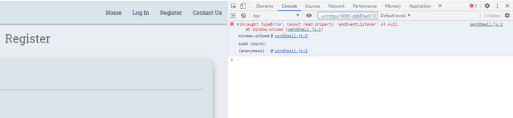
    -   The problem was solved after removing the sendEmail.js script path from base.html and adding it to contact.html.
-   After creating the javascript functionality for confirming the password in the registration filed, both the registration
    and login forms wouldn't let the user fill in the password.
    -   The issue was coming from the fact that in the app.py file, the register dictionary wasn't updated and the problem got fixed by adding
        the confirm_password respective field to the dictionary.
-   When connecting the html code for the delete dialog modal from the ads page to the javascript script path, the Delete button which triggers the
    modal wouldn't work at all. 
    -   With the amazing input of my mentor, we got to figure out and fix the bug.
    -   Because the console didn't throw any error, we checked the html code through the html validator and so we got to see that the issue
        laid in the fact that the modal id was repeating itself for every ad posted in the website.
    -   The problem was solved by adding to all three sections triggering the id a jinja index loop.
## Known Bugs
-   After submitting the message in the contact form the flash message doesn't display as expected and the form doesn't redirects to home page
    because it interracts with the javascript sendEmail.js file.
# Deployment
1. For this project you need to create a database in [MongoDB](https://www.mongodb.com/)
1. First you need to create a new workspace in GitPod.
1. Create a new Flask Application.
1. Install Flask by typing in the terminal 
```
$ pip3 install Flask
```
5. Create app.py file by typing in the terminal the command
```
$ touch app.py
```
6. Create env.py (the file where you store the environment variables) by typing in the terminal the command:
```
$ touch env.py
```
7. Open env.py and set your default environment variables:
```
os.environ.setdefault("IP", "0.0.0.0")
os.environ.setdefault("PORT", "5000")
os.environ.setdefault("SERCRET_KEY", "your_secret_key")
os.environ.setdefault("MONGO_URI", "your_mongo_uri")
os.environ.setdefault("MONGODB_NAME", "your_mongodb_name)
```
8. Before you create your Heroku application, make sure that you have set up the Procfile and requirements.txt files. Run in the terminal the following commands:
```
$ pip3 freeze --local > requirements.txt
```

```
$ echo web: python app.py > Procfile
```
9. If you don't have a [Heroku](https://heroku.com/) account, create a new one and make sure that you choose Python as Primary Development Language.
1. Login to Heroku and create new app by clicking the button "New" > "Create New App".

    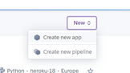
1. Give the app an unique name, select your region and click "Create App".
1. Set up Automatic deployment from your GitHub repository.

    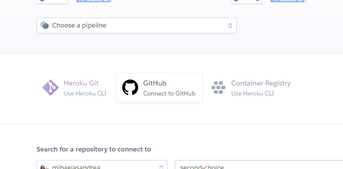
1. Make sure your github profile is displayed and add your repository name.

    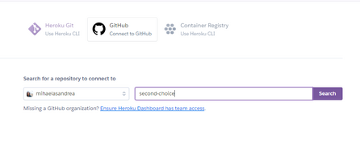
1. Click Search and once it finds your repo click connect.

    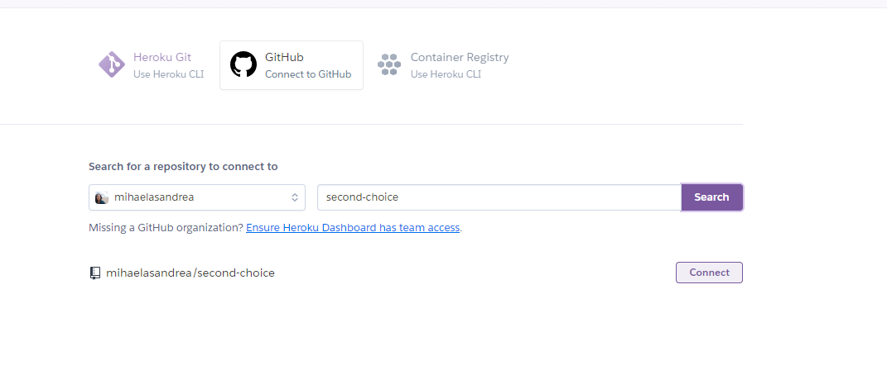
1. Before you enable Automatic Deployment you need to set your environment variables so click on Settings tab for your app.

    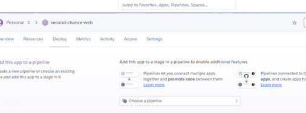
1. Then on Reveal Config Vars.

    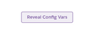
1. Add your variables here and make sure you don't include any quotes for the keys.

    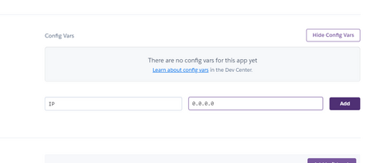
1. You need to push the two new files to the repository. Within the terminal type:
```
$ git add requirements.txt
```

```
$ git commit -m "Add requirements.txt"
```

```
$ git add Procfile`
```

```
$ git commit -m "Add Procfile"
```

```
$ git push
```
19. Back to Heroku, you can now safely "Enable Automatic Deployment"

    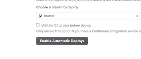
1. Click Deploy Branch

    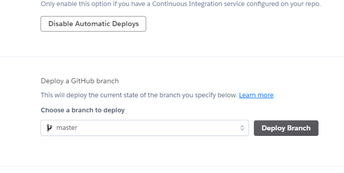
1. You should see "Your app was successfully deployed"

    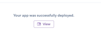
1. Click view to launch you new app.

# Forking the GitHub Repository

By forking the GitHub Repository you make a copy of the original repository on you GitHub account to view and/or make changes without affecting the original repository by using the following steps...

1. Log in to GitHub and locate the [Second-Choice GitHub Repository](https://github.com/mihaelasandrea/second-choice)
2. At the top of the Repository (not top of page) just above the "Settings" Button on the menu, locate the "Fork" Button.

    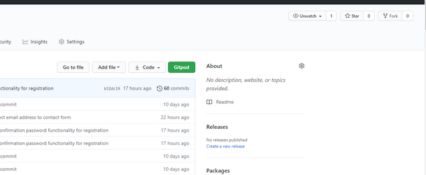
3. You should now have a copy of the original repository in your GitHub account.

# Making a Local Clone

1. Log in to GitHub and locate the [Second-Choice GitHub Repository](https://github.com/mihaelasandrea/second-choice)
2. Under the repository name, click "Clone or download".

    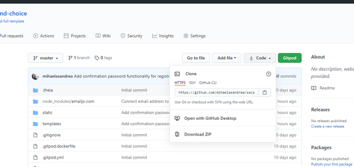
3. To clone the repository using HTTPS, under "Clone with HTTPS", copy the link.
4. Open Git Bash
5. Change the current working directory to the location where you want the cloned directory to be made.
6. Type `git clone`, and then paste the URL you copied in Step 3.

```
$ git clone https://github.com/YOUR-USERNAME/second-choice
```

7. Press Enter. Your local clone will be created.

```
$ git clone https://github.com/YOUR-USERNAME/second-choice
> Cloning into `CI-Clone`...
> remote: Counting objects: 10, done.
> remote: Compressing objects: 100% (8/8), done.
> remove: Total 10 (delta 1), reused 10 (delta 1)
> Unpacking objects: 100% (10/10), done.
```

Click [Here](https://help.github.com/en/github/creating-cloning-and-archiving-repositories/cloning-a-repository#cloning-a-repository-to-github-desktop)
    to retrieve pictures for some of the buttons and more detailed explanations of the above process.

# Credits
## Images
All images used for the ads posted in the website were taken by the developer and are subject for demonstration only.

Favicon image is taken from [Flaticon](https://www.flaticon.com/authors/freepik)
## Code

The code was written following the educational walkthrough tutorials from Code Institude.

For 404.html implementation, the code was copied from the [Flask Documentation site](https://flask.palletsprojects.com/en/master/errorhandling/)

For delete modal from profile delete button the code was taken from [w3schools.com](https://www.w3schools.com/howto/howto_css_delete_modal.asp)

For the confirmation password in the register form I used the code from [Stackoverflow](https://stackoverflow.com/questions/21727317/how-to-check-confirm-password-field-in-form-without-reloading-page)
## Tutor Support
Special thanks to **Johann** for his patience and for helping me figuring out why the delete button from the profile
template returned the 404 error message that the requested url was not found.

Special thanks to **Igor Basuga** for his kind support and valuable explanations helping me out when I got stuck with my workspace not being able to preview.

Special thanks to **Kevin** for his kind support helping me out with connecting the contact us form to the email address and pointing
me in the right direction for fixing the confirmation password functionality.

## Mentor
Special thanks to my mentor Dick Vlaanderen for his helpful feedback, support and valuable guidance with UX experience.
And a huge thank you for helping me out fixing the dialog modal issue for deleting the ads. It was brilliant to see all the steps he followed
looking for hints to solve the problem. Happy to have learned so much from him in such a short time.

## Slack Comunity
For the encouragement and the wonderful source of information that represents.

## My Family
For giving me the time and space to be able to put all my energy and resources into this learning journey.
